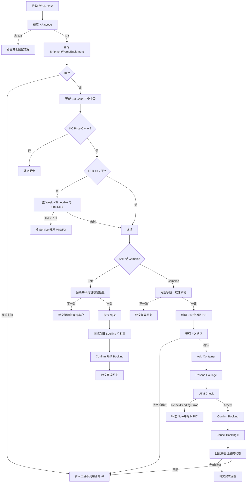

# 韩国 Split/Combine SOP 与现有 Dify 流程差距分析

## 1. 分析目的

本文比较以下资料：

- 韩国 SOP：`src/neaSOP/3 Split Combine Booking 01 - South Korea.docx`
- 中国现有 Dify 导出：`exports/split combine/`
- 根工作流：`split combine endpoint.yml`
- 主业务工作流：`Split_Combine Main.yml`
- 导出清单：`manifest.json`，共 30 个工作流，其中 29 个为递归依赖，无未解析引用

目标是在保留现有 Dify 自动化能力的基础上，确定需要怎样修改才能满足韩国 Split/Combine Booking SOP v1（2026-04-27）。本报告为静态分析，没有调用实际 GCSS、CM、ISR、FO 或发布接口，也不记录导出 YAML 中的任何密钥。

## 2. 执行摘要

现有流程不能直接用于韩国业务。

现有流程已经具备较完整的底层能力：邮件解析、Shipment 查询、Party 查询、柜量查询、Split 意图识别、自动/手动 Split、加柜、装箱调整、UTM 检查、重发 haulage、Booking Confirmation、取消 Booking、日志和结果发布。这些能力可以复用。

韩国 SOP 的核心差距集中在业务控制层：

1. 缺少韩国 scope 判断与韩文回复。
2. 缺少 CM Case 字段更新。
3. 缺少 ETD、first KMS 和 weekly timetable 判断。
4. 缺少韩国 KC 客户 Price Owner 白名单。
5. 缺少 MIG/FO 分派规则。
6. Combine 缺少完整字段一致性校验、ISR、FO 确认和 PIC 选择。
7. 部分写操作失败后仍可能继续生成成功回复。
8. Split 柜量不一致的处理与 SOP 存在歧义，需要业务确认。

因此不建议复制现有中国流程后只修改 Prompt。建议保留底层查询/API 子工作流，新增韩国策略层和审批状态机，并重构写操作后的结果核验。

## 3. 韩国 SOP 业务要求

### 3.1 Split 与 Combine 共用前置规则

1. 在 CM 中打开并检查 Case。
2. 检查是否为 DG Shipment。
   - DG：超出 AI 范围，不生成 AI 处理结果。
   - 非 DG：继续处理。
3. 更新 Case：
   - Type：`Booking`
   - Sub Type：`Amend Booking Details`
   - Reason For Case：`Split/Combine Booking`
4. 判断是否已超过 first KMS。
5. 判断 ETD 与当前日期间隔：
   - ETD 大于或等于 7 天：继续后续资格判断。
   - ETD 小于 7 天：根据 string、load port、vessel 查询 weekly timetable 中的 first KMS。
6. 如果 first KMS 已过：
   - DTCX/OTCX EXP 分派 MIG。
   - ICX、KCEC-AUTO、KCEC-TECH 分派 FO。
7. 仅 KC 客户允许继续。KC 资格由 SOP 中固定 Price Owner 名称和代码清单决定。
8. 非 KC 客户拒绝请求，并使用韩国 SOP 规定的韩文模板。

### 3.2 Split 要求

1. 比较客户邮件中提到的柜量与系统柜量。
2. 柜量一致时执行 Split。
3. 柜量不一致时发送韩文澄清模板，要求客户确认系统总柜量。
4. Split 完成后获取新 Booking Number。
5. 确认原 Booking 和新 Booking。
6. 回复客户每个 Booking Number 及对应 container volume，并使用韩文完成模板。

### 3.3 Combine 要求

1. 比较待合并 Booking 的以下字段：
   - Booked By
   - Price Owner
   - Commodity
   - NAC
   - Contact
   - POL
   - POD
   - Discharge
   - 全部 vessel/voyage
   - Service Mode
   - Service Contract
2. 任一字段不同，不允许 Combine，并使用韩国 SOP 的韩文差异模板。
3. 字段相同时创建 ISR 给 FO，确认所有 Booking 的：
   - Freetime
   - VP
   - Maersk Accelerate
4. PIC 分配规则：
   - Glovis/Hyundai Price Owner 使用 HD Auto PIC list。
   - 其他 SOP 白名单客户使用 PANTOS/SS E-goods PIC list。
5. FO 确认后执行：
   - 向客户要求保留的 Booking 加柜。
   - 重发 haulage。
   - 执行 UTM Check。
   - UTM Reject 时添加标准 Note，并要求 PIC 关闭 UTM Task。
   - Confirm Booking。
   - Cancel 不再使用的 Booking B。
6. 所有操作确认成功后，发送韩国 SOP 的韩文完成模板。

## 4. 现有 Dify 流程架构

### 4.1 入口层

`split combine endpoint.yml` 负责：

- 接收邮件和 Case 上下文。
- 提取 Booking/BL 信息。
- 调用 `Set response language`。
- 调用 `Split/Combine Main`。
- 调用 MOP Logger 和 pub/sub 发布工作流。

入口节点 `creating an object`（ID `1760338269819`）可提取 `caseInstance`、`caseNumber`、`countryName`、`reasonForCase` 和 `userConsent`。但是调用 `Split/Combine Main` 的节点（ID `1783417267931`）没有把 `countryName` 传入主流程，因此现有流程无法建立可靠的韩国 scope gate。

### 4.2 主业务层

`Split_Combine Main.yml` 负责：

- 获取最新邮件。
- 查询 Shipment Parties、Shipment Summary、Equipment、Freight Lines、Properties、Notes 和 Tasks。
- 校验请求方与 Booked By/Price Owner 的关系。
- 判断 SPOT、DG、Reefer/OOG、Gate-in/Load 等状态。
- 调用 Split Intent。
- 执行 Split 或 Combine 相关 API。
- 生成客户回复。

关键节点包括：

| 能力 | 节点 |
| --- | --- |
| Shipment Party 查询 | `GCSS Shipment Parties`，调用节点 ID `1774491995355` |
| Booked By/Price Owner 解析 | `getting the booked by & price owner party code`，ID `1773644551087` |
| 请求方校验 | `is requestor valid`，ID `1773644663736` |
| Shipment Summary | 调用节点 ID `1774495689954` |
| Summary 解析 | `Parse Shipment Summary GCSS`，ID `1773645826483` |
| DG 判断 | `DG case`，ID `1776248056943` |
| Split Intent 调用 | `get split intent`，ID `1781253498963` |
| Split Intent 路由 | `IF/ELSE 10`，ID `1781253641161` |
| Auto Split | `auto split`，ID `17812598569450` |
| Manual Split 预校验 | `manual split`，ID `1782098190280` |
| Manual Split API | `Iteration 9` / HTTP 节点，ID `1784686895370` / `1784687424888` |
| Combine 数据迭代 | `Iteration 3`，ID `1782198234717` |
| Combine 一致性预检 | `pre-check`，ID `1782203917508` |
| Combine 意图提取 | `LLM 4`，ID `1782116050641` |
| Combine 主单决定 | `get intent`，ID `1782119239564` |
| Add Container | 工具节点 ID `1782357952464` |
| Container Stuffing | 工具节点 ID `1782366233319` |
| Booking Confirmation | 工具节点 ID `1783415895422` |
| Cancel Booking 迭代 | `Iteration 7`，ID `1782785350121` |
| Combine 完成回复 | ID `17827859347240` |

### 4.3 可复用的底层工作流

以下工作流原则上可继续复用，但需要验证韩国环境权限和 API Contract：

- `GCSS Shipment Summary.yml`
- `GCSS Shipment Parties.yml`
- `GCSS equipment details.yml`
- `GCSS FreightLines.yml`
- `GCSS Shipment Properties.yml`
- `GCSS Shipment Notes.yml`
- `GCSS Filter Tasks (shipment level).yml`
- `GCSS ConfirmBookingReceivers.yml`
- `Add Shipment Notes.yml`
- `add_container.yml`
- `container_stuffing.yml`
- `UTM check.yml`
- `Resend Export Merchant Haulage.yml`
- `Confirm Booking Conformation(RFC_split_combine).yml`
- `cancel booking action.yml`
- `Reprice Action.yml`

## 5. 要求映射与差距

| 韩国 SOP 要求 | 当前实现 | 结论 |
| --- | --- | --- |
| 韩国 scope gate | 提取 `countryName`，但未传给 Main；无 KR 路由 | 缺失 |
| DG 不进入 AI | Main 在查询后通过 `DG case` 阻止写操作，但入口此前已执行邮件/意图相关 AI | 部分匹配，边界不符合 |
| 更新 CM Case 三个字段 | 只有 Case 信息提取和 Shipment Note 写入 | 缺失 |
| ETD >= 7 天判断 | 能读取 Shipment Summary，但无明确 7 天 gate | 缺失 |
| first KMS / timetable | 未发现 KMS 或 timetable 调用 | 缺失 |
| MIG/FO 分派 | 无对应节点/API | 缺失 |
| KC Price Owner 白名单 | 当前请求方校验和 exception customer 清单不是 SOP 的 20 项清单 | 缺失 |
| 非 KC 韩文拒绝 | 只有中英文路径 | 缺失 |
| Split 柜量解析与核对 | `split intent.yml` 已以系统柜量为权威并进行算术校验 | 可复用 |
| Split 数量不符澄清 | 当前 `not match` 路径倾向拒绝，不是韩国澄清模板 | 冲突 |
| Split API | Auto/Manual Split 均已有 | 可复用，但需加韩国 gate |
| 返回 Booking + volume | 当前成功回复有 Booking Number，但未完整列出每票柜量 | 部分匹配 |
| Combine 基础字段比较 | 已比较 BBY、PO、POR、POD、产品、Service Mode、Vessel 名称等 | 部分匹配 |
| Commodity/NAC/Contact/Discharge/SC/voyage | 数据不完整，部分字段未取或未比 | 缺失 |
| ISR 给 FO | 无 ISR 创建工具 | 缺失 |
| FO 确认 Freetime/VP/Accelerate | 当前由系统直接比较，且使用客户 `userConsent` 控制继续 | 冲突 |
| HD/PANTOS PIC 规则 | 无名单和分派逻辑 | 缺失 |
| Add Container | 已有 | 可复用 |
| Resend Haulage | 已有 | 可复用 |
| UTM Check | 已有检查和轮询 | 部分匹配 |
| UTM Reject 标准 Note + PIC 关闭 | 当前可能自动关闭或停止，没有 SOP 指定的人工作业契约 | 冲突 |
| Confirm Booking | 已有 helper | 可复用但需严格校验返回结果 |
| Cancel Booking B | 已有 | 可复用但需严格校验返回结果 |
| 全部成功后才通知完成 | Cancel/Confirm 的部分失败可能仍流向完成回复 | 高风险冲突 |
| 韩文成功/失败模板 | `Set response language` 只允许 `EN/CN` | 缺失 |

## 6. 高风险问题

### 6.1 Combine 可能错误选择保留 Booking

`get intent`（ID `1782119239564`）在 LLM 未提供 `master_tracking_number` 时会选择最小 Booking Number。客户未明确保留单时不应猜测，否则可能把柜量加到错误 Booking，并取消客户原本要保留的 Booking。

建议：没有明确保留 Booking 时进入 `WAIT_CUSTOMER_CONFIRMATION`，禁止任何写操作。

### 6.2 Cancel 或 Confirm 失败后可能仍回复成功

取消 Booking 的 `Iteration 7` 后直接进入 Combine 完成回复，未看到“全部取消成功”的汇总 gate。Booking Confirmation 对错误码的处理也不完整。

建议：每个写操作统一返回：

```json
{
  "success": true,
  "http_status": 200,
  "business_status": "COMPLETED",
  "retryable": false,
  "message": "",
  "tracking_number": ""
}
```

最终完成回复必须依赖所有必需操作 `success=true`，并回读 GCSS 验证最终状态。

### 6.3 DG 的“无 AI”要求未满足

现有 DG 判断发生在入口邮件处理和部分 LLM 调用之后。韩国 SOP 明确要求 DG 超出 AI scope。

建议：在调用业务 LLM 前，用结构化 Shipment Summary 查询或受控提取先做 DG gate。DG 时只记录并转人工，不调用 Split Intent 或回复生成 LLM。

### 6.4 Split 数量不一致存在 SOP 歧义

SOP 同时表达：

- 数量不一致时向客户澄清。
- 然后进入执行 Split 的步骤。

在客户没有确认前直接 Split 不安全。建议默认解释为：发送澄清后进入等待状态，收到客户回复后重新读取系统柜量并重新计算，只有闭合后才进入 Split API。该解释必须由韩国 SOP Owner 确认。

## 7. 推荐目标流程



## 8. 具体改造清单

### 8.1 `split combine endpoint.yml`

1. 将 `countryName`、Case Type/Sub Type/Reason、Case owner/service 信息传入 Main。
2. 在任何业务 LLM 前增加 `KR Scope + DG` 前置 gate。
3. 将 `Set response language` 输出扩展为 `KR/EN/CN`。
4. 对韩国请求固定使用经审批的韩文模板，不让通用 LLM自由生成操作承诺。
5. 在日志中新增 `market=KR`、`sop_version=2026.04.27-v1`、eligibility result 和人工审批状态。

### 8.2 `Split_Combine Main.yml`

新增韩国策略子流程或确定性代码节点，输出：

```json
{
  "market": "KR",
  "is_dg": false,
  "case_updated": true,
  "is_kc_customer": true,
  "etd_days": 8,
  "first_kms_passed": false,
  "service_group": "DTCX_EXP",
  "route": "CONTINUE",
  "reason_code": "ELIGIBLE"
}
```

必须完成：

- 将 SOP 的 Price Owner 名称和代码清单配置为版本化数据，不写进 LLM Prompt。
- 增加 Case 更新 API。
- 增加 KMS/timetable 查询。
- 增加 MIG/FO assignment API。
- 将 `others` 意图增加显式分支。
- 未明确保留 Booking 时禁止 Combine。
- 写操作后必须回读验证。

### 8.3 `split intent.yml`

保留现有系统柜量权威原则和算术校验，增加：

- 韩语 Split/Combine 表达和柜型写法。
- 韩国邮件回复链裁剪样例。
- `needs_clarification` 明确状态。
- 不允许模型决定 KC、KMS、DG、FO 或是否可以写系统。
- 输出必须携带证据字段和原文片段位置，便于审计。

推荐状态：

```text
AUTO_SPLIT
MANUAL_SPLIT
COMBINE
NEEDS_CLARIFICATION
NOT_MATCH
OUT_OF_SCOPE
```

### 8.4 Combine 比较节点 `pre-check`（ID `1782203917508`）

补齐并标准化：

- Commodity code/description
- NAC
- Contact
- POL/POR
- POD/Discharge
- Vessel + Voyage 的完整集合
- Service Mode
- Service Contract
- Booked By / Price Owner

字段缺失必须 fail closed，不得当成一致。

### 8.5 新增 ISR/FO/PIC 子流程

建议新增 `KR Combine FO Approval` 工作流：

1. 根据 Price Owner code 选择 HD 或 PANTOS/SS roster。
2. 创建 ISR，携带所有 Booking Number 和差异比较结果。
3. 等待并读取 FO 对 Freetime/VP/Accelerate 的确认。
4. 保存 PIC、ISR ID、确认人、确认时间和结论。
5. 只有状态为 `APPROVED` 才允许进入写操作。

### 8.6 写操作 Saga

建议按以下顺序执行，并为每一步保存状态：

1. `add_container`
2. `container_stuffing`（如业务确需）
3. `Resend Export Merchant Haulage`
4. `UTM check`
5. `Confirm Booking Conformation`
6. `cancel booking action`
7. 回读 Shipment Summary/Equipment/Tasks 验证

任一步失败：停止后续步骤，不发送成功模板，记录可重试性并转人工。

### 8.7 韩文模板

建立受版本控制的模板表，至少包括：

- 非 KC Split 拒绝
- 非 KC Combine 拒绝
- Split 柜量不一致澄清
- Split 完成（每票 Booking + volume）
- Combine 字段不一致
- Combine 完成
- DG/人工处理内部状态
- UTM Reject/Pending/Error 人工处理

模板应使用 SOP 原文并由韩国业务 Owner 审批。不要让生成式模型改写操作结果、Booking Number 或柜量。

## 9. 分阶段实施建议

### P0：上线前阻断项

- 韩国请求禁止进入现有自动写路径。
- 实现 KR scope、DG、KC 白名单 gate。
- 修复 Cancel/Confirm 失败仍可能回复成功的问题。
- 禁止模型猜测保留 Booking。
- 将导出 YAML 中的凭据视为已暴露并完成轮换；运行时改用 Secret 注入。

### P1：韩国基础资格与 Split

- Case 字段更新。
- ETD/first KMS/timetable 与 MIG/FO 路由。
- 韩文模板和 `KR` 语言。
- Split 数量澄清状态机。
- Split 完成后的 Booking/volume 回读和确认。

### P2：Combine 审批与操作安全

- 完整字段比较。
- ISR、PIC 选择和 FO 确认。
- 写操作 Saga、结果汇总和回读验证。
- UTM Reject 标准 Note 与人工关闭路径。

### P3：治理与可观测性

- 幂等键和重复邮件防护。
- API 超时、重试和补偿规则。
- SOP 版本、审批证据和状态审计。
- 凭据扫描、Prompt/DSL 回归测试和告警。

## 10. 测试与验收矩阵

| 场景 | 预期结果 |
| --- | --- |
| 非韩国请求 | 不进入 KR 流程，不调用 KR 写 API |
| DG=true 或 DG 未知 | 不调用业务 LLM和写 API，转人工 |
| 20 项 KC 白名单逐项测试 | 精确代码匹配时放行 |
| KC 名称近似但代码错误 | 拒绝，不允许模糊匹配 |
| ETD 恰好 7 天 | 按 SOP 进入 >=7 天路径 |
| ETD 小于 7 天且 KMS 已过 | 按 service group 正确分派 MIG/FO |
| Split 柜量一致 | 执行 Split并返回每票 volume |
| Split 柜量不一致 | 只发澄清，不写 GCSS |
| Split API 部分失败 | 不报告整体成功，转人工并保留真实结果 |
| Combine 任一字段不一致 | 不创建写操作，发送韩文差异模板 |
| Combine 全字段一致 | 先 ISR/FO approval，后执行写操作 |
| FO 未确认、拒绝或超时 | 无写操作，转人工 |
| UTM Reject/Pending/Error | 写标准 Note并分配 PIC，不回复完成 |
| Confirm Booking 失败 | 不执行取消或不回复完成，按补偿策略处理 |
| Cancel Booking B 失败 | 不回复完成，进入恢复/人工状态 |
| 所有步骤成功 | 回读状态一致后发送韩文完成模板 |
| 重复处理同一邮件 | 幂等，不重复 Split/Add/Cancel |

## 11. 待业务确认

1. Split 柜量不一致时，“澄清后 go step 7”的准确含义。
2. 韩国 scope 的权威字段：Case country、POL、Price Owner、客户组织或其他字段。
3. First KMS 数据源、适用航段和 weekly timetable Owner。
4. DTCX/OTCX EXP、ICX、KCEC-AUTO、KCEC-TECH 的稳定识别字段。
5. HD 与 PANTOS/SS PIC 名单的 API、更新频率和 fallback。
6. FO Approval 的 SLA、超时升级和拒绝后的客户回复。
7. Combine 写操作失败时是否有允许的自动补偿动作。
8. 韩国 SOP 是否允许任何 SPOT Booking 自动 Split/Combine，以及相关费用提示规则。

## 12. 最终建议

采用“复用底层、重建控制层”的方案：

- 复用现有 GCSS 查询和写操作子工作流。
- 新建韩国 eligibility 与 FO approval 子工作流。
- 将业务资格、日期、名单、字段比较和审批全部改为确定性逻辑。
- LLM 只负责解析非结构化邮件，不负责是否允许操作。
- 任何写操作必须有成功聚合和回读验证。
- 所有韩国客户回复采用业务审批的固定韩文模板。

在 P0 和 P1 完成且通过验收前，不应让现有中国流程对韩国 Booking 自动执行变更。
